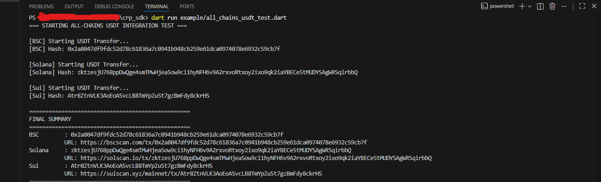
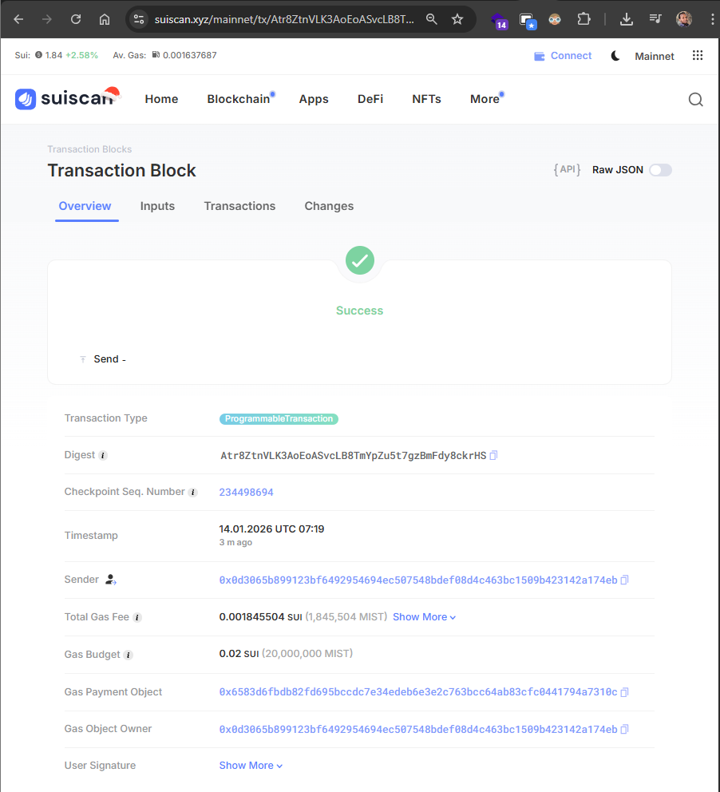

<<<<<<< HEAD
# crp_demo

A new Flutter project.

## Getting Started

This project is a starting point for a Flutter application.

A few resources to get you started if this is your first Flutter project:

- [Lab: Write your first Flutter app](https://docs.flutter.dev/get-started/codelab)
- [Cookbook: Useful Flutter samples](https://docs.flutter.dev/cookbook)

For help getting started with Flutter development, view the
[online documentation](https://docs.flutter.dev/), which offers tutorials,
samples, guidance on mobile development, and a full API reference.
=======
# CRP Sui Demo

Minimal demo proving CRP end-to-end USDT transfer on **Sui** using local signing.

## What it demonstrates
1) Prepare transaction via CRP API  
2) Sign locally using CRP SDK  
3) Broadcast and wait for finality  
4) Display tx hash + explorer link  

## Mainnet Proof (Sui)
Tx: `Atr8ZtnVLK3AoEoASvcLB8TmYpZu5t7gzBmFdy8ckrHS`  
Explorer: https://suiscan.xyz/mainnet/tx/Atr8ZtnVLK3AoEoASvcLB8TmYpZu5t7gzBmFdy8ckrHS

> **Status:** Success (mainnet)

## Proof Screenshots

### Terminal run

### SuiScan success

## License
MIT
>>>>>>> ad9eb5d06702ea0611bd891a0ce29c9321f25688
